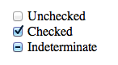
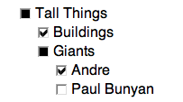
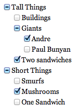

# 不确定复选框

复选框只有两种状态：被选状态(`checked`) 和 未被选择状态 (`unchecked`)。他们可以携带任何值，但是他们要么通过一次表单提交中将值提交（在被选状态）或者不提交（在未被选择状态下）。默认是未被选择状态 (`unchecked`)。你可以像下面这样使用：

```html
<!-- Default to unchecked -->
<input type="checkbox" />

<!-- Default to checked, XHTML -->
<input type="checkbox" checked="checked" />

<!-- Default to checked, HTML5 -->
<input type="checkbox" checked>
```

在视觉上，实际上复选框有三种状态：被选择状态 (`checked`) 、未被选择状态(`unchecked`) 以及 不确定状态 (`indeterminate`)。他们看起来像这样：



这里有一些关于不确定复选框的事情：

**你不能通过HTML的方式来创建一个不确定复选框。**没有不确定这种HTML属性，它是复选框的属性，只能通过JavaScript来改变属性。

``` js
var checkbox = document.getElementById("some-checkbox");
checkbox.indeterminate = true;
```

或者通过JQuery的样式修改：

``` js
$("#some-checkbox").prop("indeterminate", true); // prop is Jquery 1.6+
```

**不确定状态仅仅是视觉上的一种状态。**复选框仍然仅仅只有被选择和未被选择两种状态。也就是说视觉上的不确定状态隐藏了真正的复选框的值，这使得在你的UI上有了更好的理解。

就如同其他两种复选框状态一样，不确定状态下在不同浏览器下有不同的样式。这是Opera 11.50在Mac上的样子：



## 使用场景

我写这篇文章的原因是因为我在遇到一种情况使用了不确定的复选框：嵌套复选框。
每个复选框都可能包含子复选框。如果所有这些子复选框都是checked状态，则为checked。如果所有未选中，则取消选中。如果其中一些子复选框选中了，则它处于不确定状态（在这种情况下，符号意思是“部分”是checked状态）。



``` html
<h1>Indeterminate Checkboxes</h1>

<ul>
  <li>
    <input type="checkbox" name="tall" id="tall">
    <label for="tall">Tall Things</label>

    <ul>
      <li>
        <input type="checkbox" name="tall-1" id="tall-1">
        <label for="tall-1">Buildings</label>
      </li>
      <li>
        <input type="checkbox" name="tall-2" id="tall-2">
        <label for="tall-2">Giants</label>

        <ul>
          <li>
            <input type="checkbox" name="tall-2-1" id="tall-2-1">
            <label for="tall-2-1">Andre</label>
          </li>
          <li>
            <input type="checkbox" name="tall-2-2" id="tall-2-2">
            <label for="tall-2-2">Paul Bunyan</label>
          </li>
        </ul>
      </li>
      <li>
        <input type="checkbox" name="tall-3" id="tall-3">
        <label for="tall-3">Two sandwiches</label>
      </li>
    </ul>
  </li>
  <li>
    <input type="checkbox" name="short" id="short">
    <label for="short">Short Things</label>

    <ul>
      <li>
        <input type="checkbox" name="short-1" id="short-1">
        <label for="short-1">Smurfs</label>
      </li>
      <li>
        <input type="checkbox" name="short-2" id="short-2">
        <label for="short-2">Mushrooms</label>
      </li>
      <li>
        <input type="checkbox" name="short-3" id="short-3">
        <label for="short-3">One Sandwich</label>
      </li>
    </ul>
  </li>
</ul>
```

``` css
body {
  padding: 20px;
}
ul { 
  list-style: none;
  margin: 5px 20px;
}
li {
  margin: 10px 0;
}
```

``` js
$('input[type="checkbox"]').change(function(e) {

  var checked = $(this).prop("checked"),
      container = $(this).parent(),
      siblings = container.siblings();

  container.find('input[type="checkbox"]').prop({
    indeterminate: false,
    checked: checked
  });

  function checkSiblings(el) {

    var parent = el.parent().parent(),
        all = true;

    el.siblings().each(function() {
      return all = ($(this).children('input[type="checkbox"]').prop("checked") === checked);
    });

    if (all && checked) {

      parent.children('input[type="checkbox"]').prop({
        indeterminate: false,
        checked: checked
      });

      checkSiblings(parent);

    } else if (all && !checked) {

      parent.children('input[type="checkbox"]').prop("checked", checked);
      parent.children('input[type="checkbox"]').prop("indeterminate", (parent.find('input[type="checkbox"]:checked').length > 0));
      checkSiblings(parent);

    } else {

      el.parents("li").children('input[type="checkbox"]').prop({
        indeterminate: true,
        checked: false
      });

    }

  }

  checkSiblings(container);
});
```

更完善的代码，点击[这里](https://github.com/TheNotary/IndeterminateCheckboxes/blob/master/indeterminateCheckbox.js)


## 在三种状态下轮换

一种方式是通过添加额外的`data-`属性：

``` js
var $check = $("input[type=checkbox]"), el;
$check
   .data('checked',0)
   .click(function(e) {
       
        el = $(this);
                
        switch(el.data('checked')) {
            
            // unchecked, going indeterminate
            case 0:
                el.data('checked',1);
                el.prop('indeterminate',true);
                break;
            
            // indeterminate, going checked
            case 1:
                el.data('checked',2);
                el.prop('indeterminate',false);
                el.prop('checked',true);                
                break;
            
            // checked, going unchecked
            default:  
                el.data('checked',0);
                el.prop('indeterminate',false);
                el.prop('checked',false);
                
        }
        
    });
```

还有一种更简洁的方式，通过 `readOnly`属性。

``` html
<input type="checkbox" id="cb1" onclick="ts(this)">
```

``` js
function ts(cb) {
    if (cb.readOnly) cb.checked = cb.readOnly = false;
    else if (!cb.checked) cb.readOnly = cb.indeterminate = true;
}
```

*原文：https://css-tricks.com/indeterminate-checkboxes/*